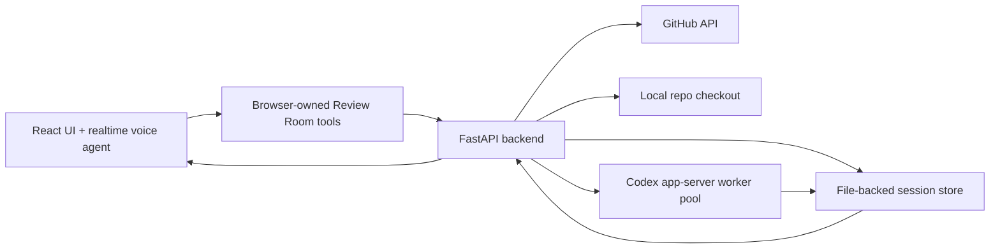

# Review Room

Review Room is a voice-first code review cockpit for GitHub pull requests. It loads a PR into a focused three-pane interface: changed files on the left, PR details and diffs in the center, and an AI review workbench on the right.

The core workflow is:

1. Open a GitHub PR in Review Room.
2. Browse changed files and select code in the diff.
3. Ask a question by voice or text.
4. Review Room sends the PR, file, and selection context to a Codex-backed backend.
5. The answer appears as a persistent workbench thread next to the diff.

The product goal is not to replace human review. Review Room helps a human reviewer understand large or AI-generated PRs faster by keeping code, review context, draft comments, and AI investigation threads in one place.

## What It Does

- Loads public GitHub pull requests.
- Shows changed files, PR metadata, imported GitHub review comments, and unified diffs.
- Tracks the current file, selected diff lines, focused thread, and selected draft comment.
- Lets the reviewer ask context-aware questions about the PR.
- Runs Codex app-server threads from the backend against a checked-out copy of the repo.
- Streams answers into persistent AI workbench accordions.
- Renders Markdown and Mermaid diagrams in thread responses.
- Supports local draft PR comments, editing/deleting them, importing existing GitHub comments, and publishing review comments/reviews to GitHub.
- Gives the browser voice agent tools for navigating files, reading changed code, searching threads, drafting comments, and submitting reviews.

## Architecture



### Frontend

The frontend is a Vite React app in `web/`.

The UI owns interaction state:

- active PR session
- active file
- selected diff range
- focused AI thread
- selected draft comment
- review submission state

The voice integration lives in the browser. It uses `realtime-voice-component` to run a browser-side voice agent with a constrained tool set. The voice agent does not directly manipulate the DOM. Instead, it calls Review Room tools implemented by the React app.

Examples of browser-owned tools:

- ask a new Codex-backed review question
- follow up on the focused thread
- list/search/read AI threads
- navigate to a file or thread
- read changed file ranges
- draft/edit/delete PR comments
- set the top-level review discussion comment
- choose approve/request changes/comment
- submit the GitHub review

This keeps voice behavior explicit: the model can request app actions, but the app decides how those actions affect UI state and backend calls.

### Backend

The backend is a FastAPI service in `server/`.

It is responsible for:

- parsing GitHub PR URLs
- fetching PR metadata, changed files, review comments, and comment locations
- checking out the repository locally
- storing review sessions on disk
- creating and updating AI review threads
- publishing draft review comments and review submissions to GitHub
- managing Codex app-server workers

Review sessions are file-backed under `.review-room/`, which makes demo state survive backend restarts without introducing a database.

### Codex App Server

The backend talks to Codex through long-lived `codex app-server` subprocesses over stdio.

Review Room starts a pool of Codex app-server workers on backend boot. Each Codex-backed AI thread gets a prompt containing:

- the user request
- PR metadata
- active file
- selected file and line range
- selected code
- instructions for grounded Markdown responses

Codex runs with the checked-out PR repository as its working directory, so it can inspect files, search for tests, find call sites, and reason across the repo. The backend streams deltas into the session store, and the frontend polls the session to render running/completed thread state.

The worker pool allows multiple initial analysis threads to run at once instead of serializing all review work through a single app-server process.

## Data Flow

### Loading a PR

1. The frontend checks for `?pr=...`.
2. If no query param is present, it calls `GET /api/bootstrap`.
3. The backend returns `REVIEW_ROOM_PR_URL` when configured.
4. The frontend calls `POST /api/reviews`.
5. The backend fetches GitHub PR data, imports existing PR review comments, checks out the repo, creates or reloads a file-backed review session, and queues configured initial analysis threads.

### Asking a Question

1. The reviewer selects code or focuses a file/thread.
2. The reviewer types or speaks a question.
3. The browser voice agent calls an app tool such as `ask_general_question`.
4. The React app packages the current Review Room context and calls the backend.
5. The backend creates a Review Room thread and starts a Codex turn in the repo checkout.
6. Codex output is persisted to the session store.
7. The right-hand AI workbench updates with the answer.

### Drafting and Publishing Comments

Draft comments are local until the reviewer publishes them. The browser agent can draft, edit, delete, and list comments through app tools. Publishing to GitHub is explicit and goes through backend endpoints that call the GitHub API.

The review submission flow supports:

- publishing inline PR comments
- leaving a top-level PR discussion comment
- approving
- requesting changes

## Running Locally

Install dependencies:

```bash
npm install
npm --prefix web install
cd server && uv sync
```

Start the backend:

```bash
REVIEW_ROOM_PR_URL="https://github.com/owner/repo/pull/123" npm run dev:server
```

Start the frontend:

```bash
npm run dev:web
```

Open:

```text
http://127.0.0.1:5173/?pr=https://github.com/owner/repo/pull/123
```

## Configuration

Useful environment variables:

- `REVIEW_ROOM_PR_URL`: default PR URL returned by `/api/bootstrap`.
- `GITHUB_TOKEN` or `GH_TOKEN`: GitHub API token. If absent, the backend tries `gh auth token`.
- `OPENAI_API_KEY`: used by the realtime voice session proxy.
- `REVIEW_ROOM_CODEX_COMMAND`: Codex executable path. Defaults to `codex`.
- `REVIEW_ROOM_CODEX_CONCURRENCY`: number of Codex app-server workers. Defaults to `5`.
- `REVIEW_ROOM_WARM_CODEX_ON_STARTUP`: set to `0`, `false`, or `no` to skip startup warmup.
- `REVIEW_ROOM_INIT_THREADS`: comma-separated initial thread keys, or empty to disable initial analysis threads.

## Tests

Run backend tests:

```bash
npm run test:server
```

Run frontend tests:

```bash
npm run test:web
```

## Demo Shape

A good demo flow is:

1. Boot with a PR URL.
2. Show changed files, PR description, imported comments, and AI workbench threads.
3. Open a changed file.
4. Select a changed block.
5. Ask: "Explain this."
6. Ask: "Diagram this flow."
7. Ask: "Find the tests for this."
8. Ask: "Add PR comments for the test gaps."
9. Review the draft comments.
10. Set a review decision and discussion comment.
11. Publish when ready.
